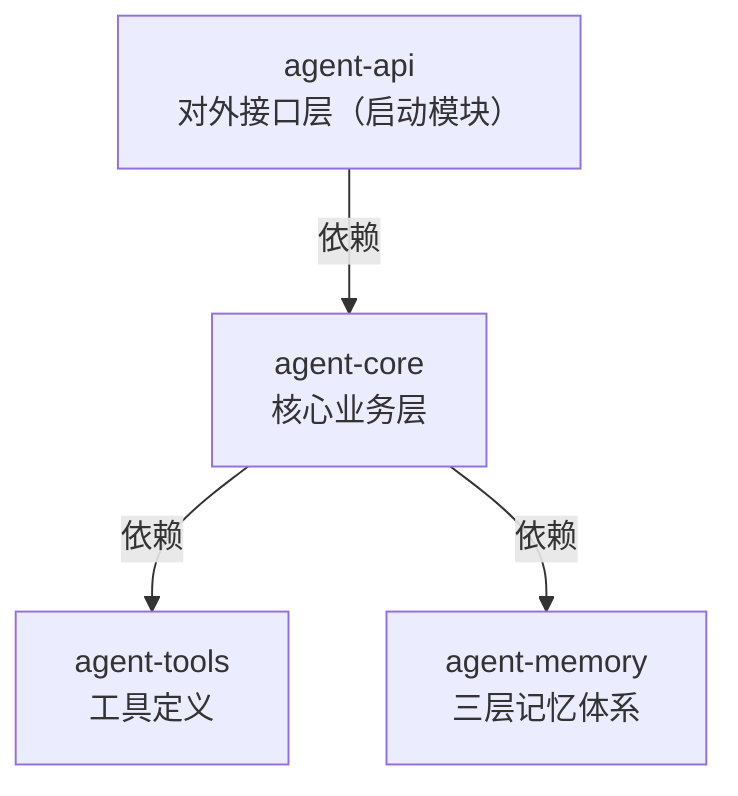
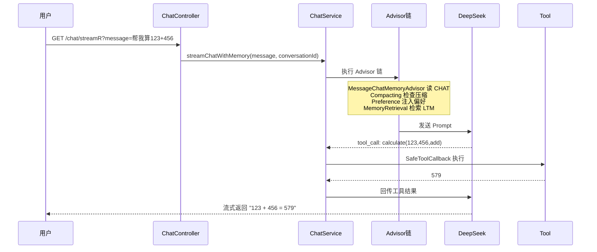

# Java 后端转 Agent 开发：3 个月实战学习规划书

> 第一阶段整合 & 项目雏形

---

## 一、项目技术栈

| 类别 | 技术 | 版本 |
|------|------|:---:|
| 语言 | Java | 21 |
| 框架 | Spring Boot | 3.5.15 |
| AI 框架 | Spring AI | 1.0.9 |
| 缓存 | Redis | 7.x |
| 前端 | 原生 HTML + JS | - |
| 模型 | DeepSeek | deepseek-v4-pro |
| 构建 | Maven | 3.9+ |

> ⚠️ 版本请以 `pom.xml` 中 `spring-boot-starter-parent` 的实际值为准。

---

## 二、项目设计

### 2.1 模块化设计

项目分为 4 个 Maven 模块，遵循**单向依赖、无循环**原则。



**依赖关系**：

```text
agent-api  ← 对外接口层（启动模块）
    └── agent-core  ← 核心业务层
            ├── agent-tools   ← 工具定义
            └── agent-memory  ← 三层记忆体系
```

| 模块 | 依赖内部模块 | 说明 |
|------|:---:|------|
| `agent-tools` | 无 | 最底层，独立可复用 |
| `agent-memory` | 无 | 独立，仅依赖 Redis |
| `agent-core` | tools、memory | 组装核心业务 |
| `agent-api` | agent-core | 对外暴露接口（传递依赖 tools、memory） |

**Maven 模块声明**：

```xml
<modules>
    <module>agent-tools</module>
    <module>agent-memory</module>
    <module>agent-core</module>
    <module>agent-api</module>
</modules>
```

---

### 2.2 agent-tools — 工具模块

**职责**：定义所有可被大模型调用的工具。

**设计要点**：

1. **不依赖任何内部模块**——独立、可复用、可测试
2. 工具在 `ChatService` 中通过 `ChatClient` 随请求发给大模型，**由大模型自主判断调用哪个工具**——不是硬编码调用
3. 每个工具都用 `SafeToolCallback` 包装，提供：
    - 超时控制（默认 10 秒）
    - 异常兜底（技术异常 → 友好文本）
    - 入参出参日志
    - 出参截断（防止日志刷屏）

**内置工具**：

| 工具 | 功能 |
|------|------|
| `CalculatorTools` | 加减乘除 |
| `TextAnalysisTools` | 字数统计、关键词计数 |
| `OrderTools` | 订单状态查询 |
| `TodoTools` | 待办事项管理 |
| `RiskTools` | 危险操作（测试异常兜底） |
| `EntertainmentTools` | 笑话、名言 |
| `PreferenceTools` | 保存用户偏好 |
| `MemoryTools` | 保存长期记忆 |

---

### 2.3 agent-memory — 记忆模块

**职责**：缓存与记忆管理，采用**三层记忆体系**。

**三层记忆体系**：

| 存储 | 中文名 | 写入方 | 触发 |
|------|:---:|------|:---:|
| `CHAT:*` | 会话记忆 | `RedisChatMemoryRepository` | 自动（每轮） |
| `LTM:*` | 长期记忆 | `LongTermMemoryService` | 模型调工具 |
| `USER_PREF:*` | 用户偏好 | `UserPreferenceService` | 模型调工具 |

**对应 Advisor**：

| Advisor | order | 职责 |
|---------|:---:|------|
| `MessageChatMemoryAdvisor` | 极小 | 读写 `CHAT:*`，注入会话历史 |
| `CompactingChatMemoryAdvisor` | 50 | CHAT 超阈值时压缩旧消息为摘要 |
| `PreferenceAdvisor` | 100 | 读 `USER_PREF:*`，注入偏好 |
| `MemoryRetrievalAdvisor` | 200 | 关键词检索 `LTM:*`，注入相关记忆 |

**设计要点**：

1. **数据存 Redis**：会话历史、长期记忆、用户偏好分别用不同 key 前缀隔离
2. **消息压缩**：`CompactingChatMemoryAdvisor` 在 CHAT 超过 100 条时，调模型把旧消息压缩成摘要，保留最近 20 条
3. **敏感脱敏**：`SensitiveDataMasker` 在写入长期记忆前对手机号、身份证、银行卡等脱敏
4. **摘要使用独立 Client**：`summarizerClient` 不挂任何 Advisor，避免循环依赖，节省 token 开销
5. **配置类分离**：
    - `CompactionConfig`：压缩阈值配置（`@ConfigurationProperties`）
    - `CompactionBeanConfig`：压缩相关 Bean 装配
    - `ChatMemoryConfig`：`ChatMemory` Bean 定义

**每次用户会话时**，根据 userId 从 Redis 检索：

- 偏好记忆（`USER_PREF:*`）
- 长期记忆（`LTM:*`）
- 近期会话历史（`CHAT:*`）

三者合并注入 SystemMessage，提供给大模型。

---

### 2.4 agent-core — 核心模块

**职责**：业务编排 + 装配。

**核心组件**：

| 类 | 职责 |
|------|------|
| `ChatService` | 对话主入口，注册 `agent-tools` 定义的工具，引用 `ChatClient` |
| `ChatClientConfig` | 定义多个 `ChatClient`，按需使用 |
| `ToolLoggingAdvisor` | 打印工具调用情况（工具名、Schema、入参出参） |
| `SessionUtils` | 用户 ID 检查工具（服务端 Session 中取可信 userId） |

**ChatClient 装配**：

| Bean 名 | 用途 | 挂载 Advisor |
|---------|------|---------------|
| `redisChatClient` | 主业务 Client | 5 个（记忆 / 压缩 / 偏好 / 检索 / 日志） |
| `plainChatClient` | 简单调用 | 无 |
| `summarizerClient` | 摘要生成 | 无（避免循环依赖） |

---

### 2.5 agent-api — 接口模块

**职责**：对外提供接口 + 静态页面。

**核心组件**：

| 组件 | 职责 |
|------|------|
| `ChatController` | 对话接口（同步 / 流式 / 流式+记忆） |
| `AuthController` | 邀请码登录（演示用） |
| `GlobalExceptionHandler` | 全局异常处理 |
| `ApiResponse<T>` | 统一响应类 |
| `static/chat.html` | 单文件聊天界面 |

**设计要点**：

1. **统一响应体**：同步接口用 `ApiResponse<T>` 包装；**流式接口保持裸 `Flux<String>`**（SSE 协议要求，不能包装）
2. **简易登录**：邀请码映射到固定 userId，写入 Session，实现用户会话信息和记忆的跨设备共享
3. **`common` 包**：
    - `ApiResponse<T>`：全局统一响应类
    - `GlobalExceptionHandler`：全局异常处理类
4. **`@RestControllerAdvice` 的作用范围**：整个 Spring MVC 的 `DispatcherServlet`——拦截"冒泡到 Controller 层的所有异常"，**不管异常最初来自哪个模块**

**异常分层兜底**：

| 时机 | 兜底方 | 处理方式 |
|------|:---:|---------|
| 流开始前 | `GlobalExceptionHandler` | 返回 `ApiResponse` |
| 流开始后 | `ChatService.onErrorResume` | 转成流内提示文本 |

---

## 三、项目目录结构

```text
FirstAgentProject/
├── pom.xml                                   # 父 POM（packaging=pom）
├── README.md
│
├── agent-tools/                              # 工具模块
│   └── src/main/java/org/example/tools/
│       ├── CalculatorTools.java
│       ├── TextAnalysisTools.java
│       ├── OrderTools.java
│       ├── TodoTools.java
│       ├── RiskTools.java
│       ├── EntertainmentTools.java
│       ├── PreferenceTools.java
│       ├── MemoryTools.java
│       └── SafeToolCallback.java
│
├── agent-memory/                             # 记忆模块
│   └── src/main/java/org/example/
│       ├── advisor/
│       │   ├── CompactingChatMemoryAdvisor.java
│       │   ├── PreferenceAdvisor.java
│       │   └── MemoryRetrievalAdvisor.java
│       ├── config/
│       │   ├── ChatMemoryConfig.java
│       │   ├── CompactionConfig.java
│       │   └── CompactionBeanConfig.java
│       ├── memory/
│       │   └── LongTermMemoryService.java
│       ├── preference/
│       │   └── UserPreferenceService.java
│       ├── repository/
│       │   ├── RedisChatMemoryRepository.java
│       │   └── MessageDto.java
│       └── utils/
│           └── SensitiveDataMasker.java
│
├── agent-core/                               # 核心模块
│   └── src/main/java/org/example/
│       ├── service/
│       │   └── ChatService.java
│       ├── advisor/
│       │   └── ToolLoggingAdvisor.java
│       ├── config/
│       │   ├── ChatClientConfig.java
│       │   └── BeanDebugConfig.java
│       └── utils/
│           └── SessionUtils.java
│
└── agent-api/                                # 接口模块（启动）
    └── src/main/
        ├── java/org/example/
        │   ├── FirstAgentProjectApplication.java
        │   ├── controller/
        │   │   ├── ChatController.java
        │   │   └── AuthController.java
        │   └── common/
        │       ├── ApiResponse.java
        │       └── GlobalExceptionHandler.java
        └── resources/
            ├── application.yml
            └── static/
                └── chat.html
```

---

## 四、启动方式

### 4.1 前置要求

| 组件 | 版本 | 检查命令 |
|------|:---:|---------|
| JDK | 21+ | `java -version` |
| Maven | 3.9+ | `mvn -v` |
| Redis | 7.x | `redis-cli ping` → `PONG` |
| DeepSeek API Key | - | 平台申请 |

### 4.2 启动 Redis

```bash
docker run -d --name redis -p 6379:6379 redis:7-alpine
redis-cli ping    # 应返回 PONG
```

### 4.3 配置文件

编辑 `agent-api/src/main/resources/application.yml`：

```yaml
server:
  port: 8080
  servlet:
    context-path: /fap
    session:
      timeout: 86400

spring:
  ai:
    openai:
      api-key: ${DEEPSEEK_API_KEY}
      base-url: https://api.deepseek.com/v1
      chat:
        options:
          model: deepseek-chat

  data:
    redis:
      host: localhost
      port: 6379
      database: 0

app:
  compaction:
    max-messages-before-compaction: 100
    keep-recent-messages: 20

logging:
  level:
    org.springframework.ai: DEBUG
```

**API Key 配置方式**（推荐环境变量）：

```bash
export DEEPSEEK_API_KEY=sk-你的Key
```

IDEA 中：`Run` → `Edit Configurations` → `Environment variables` 添加 `DEEPSEEK_API_KEY=sk-xxx`。

### 4.4 编译 & 启动

```bash
# 编译所有模块
mvn clean install -DskipTests

# 启动（在项目根目录）
mvn spring-boot:run -pl agent-api
```

或直接运行 IDEA 中 `agent-api` 模块的启动类 `FirstAgentProjectApplication`。

### 4.5 访问地址

| 地址 | 用途 |
|------|------|
| `http://localhost:8080/fap/chat.html` | 聊天界面 |
| `http://localhost:8080/fap/chat/sync?message=你好` | 同步接口 |
| `http://localhost:8080/fap/chat/streamR?message=你好` | 流式接口 |

**测试邀请码**：`ALICE` 或 `BOB`

---

## 五、API 接口

### 5.1 对话接口

| 方法 | 路径 | 说明 | 返回 |
|------|------|------|------|
| `GET` | `/chat/sync?message=xxx` | 同步对话 | `ApiResponse<String>` |
| `GET` | `/chat/stream?message=xxx` | 流式对话 | `Flux<String>`（SSE） |
| `GET` | `/chat/streamR?message=xxx` | 流式 + 记忆 + 工具 | `Flux<String>`（SSE） |
| `POST` | `/chat/clear` | 清空当前会话 | `ApiResponse<Void>` |

### 5.2 认证接口

| 方法 | 路径 | 说明 |
|------|------|------|
| `POST` | `/auth/login?code=ALICE` | 邀请码登录 |
| `GET` | `/auth/me` | 查询当前登录用户 |
| `POST` | `/auth/logout` | 退出登录 |

### 5.3 响应格式

**同步接口成功**：

```json
{
    "code": 200,
    "message": "success",
    "data": "你好，有什么可以帮你的？"
}
```

**异常响应**：

```json
{
    "code": 401,
    "message": "未登录，请先输入邀请码",
    "data": null
}
```

**流式接口**（SSE）：

```text
data: 你好
data: ，我
data: 是
data: Agent
```

---

## 六、核心机制

### 6.1 一次对话的完整链路

以 `streamR` 接口为例：



### 6.2 三层记忆配合

**用户问**："我那个退货的事怎么样了"

| Advisor | 读取 | 内容 |
|---------|------|------|
| `MessageChatMemoryAdvisor` | `CHAT:*` | 本会话历史 |
| `PreferenceAdvisor` | `USER_PREF:*` | `{city:合肥}` |
| `MemoryRetrievalAdvisor` | `LTM:*` | "订单1001退货，客服承诺3天" |

三者合并注入 SystemMessage，模型基于这些信息回答。

### 6.3 异常分层兜底

| 层级 | 兜底方 | 处理方式 |
|------|--------|---------|
| 工具内部 | 工具方法 try-catch | 业务异常 → 友好文本 |
| 工具包装 | `SafeToolCallback` | 超时、系统异常 → 友好文本 |
| 流开始前 | `GlobalExceptionHandler` | 请求级异常 → `ApiResponse` |
| 流开始后 | `ChatService.onErrorResume` | 流内异常 → 流内提示 |

### 6.4 跨设备会话隔离

**开发阶段**：

- 邀请码 → 固定 userId → 写入 Session
- `conversationId = userId`
- 任何设备输入相同邀请码 = 同一用户 = 共享记忆

**生产阶段**：

- 账号密码 + BCrypt
- Spring Session + Redis 持久化
- `conversationId = userId:sessionTag`（多设备独立对话 + 共享偏好）

---

## 七、工具调用日志示例

```text
========== [请求] ==========
[USER] 帮我计算 123 + 456 等于多少
---------- 已注册工具 (8 个) ----------
🔧 工具: calculate | 描述: 执行基本的数学运算 | 参数: {...}
...
🎯 [工具调用开始] calculate | 入参: {"a":123,"b":456,"operation":"add"}
✅ [工具调用成功] calculate | 耗时: 2ms | 出参: 579
========== [流式响应完成] ==========
123 + 456 等于 **579**。
```

---

## 八、常见问题

**Q1：启动报 `conversationId cannot be null`？**

A：所有走 `redisChatClient` 的调用必须传 `conversationId`。检查 `.advisors(a -> a.param(ChatMemory.CONVERSATION_ID, cid))` 是否传入。

**Q2：模型调用工具后 Redis 里看不到 tool_call？**

A：`MessageChatMemoryAdvisor` 只保存"面向用户的消息"，tool_call 的中间态被丢弃。完整工具调用记录在 `SafeToolCallback` 的日志里。

**Q3：换浏览器记忆丢失？**

A：邀请码登录依赖 `JSESSIONID` Cookie。换浏览器需重新登录（开发阶段），生产环境用 Spring Session + Redis。

**Q4：Compacting 没触发？**

A：检查 `CompactionConfig.maxMessagesBeforeCompaction` 是否小于 `maxMessages(200)`。推荐 100 / 20 配置。

**Q5：全局异常没生效？**

A：检查 `GlobalExceptionHandler` 是否在 `org.example.*` 包下，或启动类是否显式指定了 `scanBasePackages`。

---

## 九、后续路线

| 阶段 | 任务 | 状态 |
|------|------|:---:|
| 第一阶段 | 工具调用 + 流式 + 三层记忆 | ✅ |
| 第二阶段 | RAG（pgvector + 文档检索） | ⏳ |
| 第三阶段 | 工作流编排 + 多智能体协作 | ⏳ |
| 生产化 | 认证 + 监控 + 灰度 | ⏳ |

---

## 十、许可

个人学习项目，可自由参考。