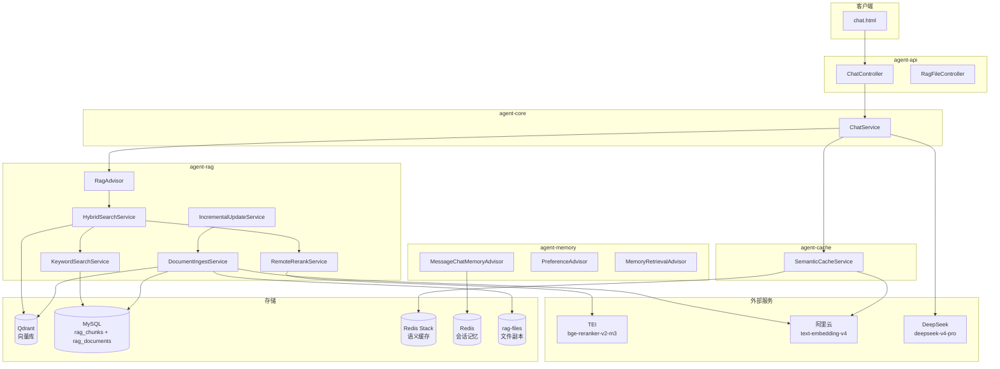
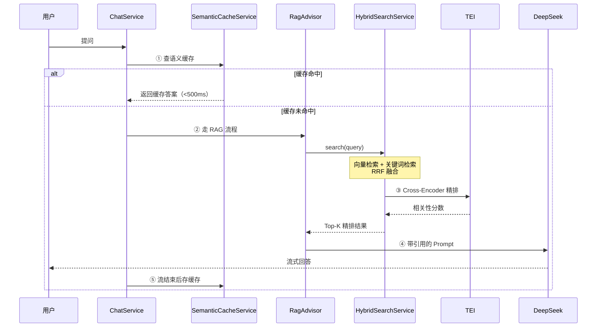

# RAG 阶段总结报告

> 从零搭建的企业级 RAG 系统 —— 基础 + 优化两阶段完成
> 完成日期：2026-09-27

---

## 一、阶段总览

| 阶段 | 周期 | 核心成果 |
|------|:---:|---------|
| **RAG 基础** | D29 ~ D37 | 打通"文档 → 向量 → 检索 → 生成"全链路 |
| **RAG 优化** | D38 ~ D42 | 混合检索 / Cross-Encoder 重排 / Prompt 工程 / 增量更新 / 语义缓存 |

**最终能力**：一个支持多文档、混合检索、精排、缓存的生产级 RAG 系统。

---

## 二、系统架构

### 2.1 整体架构



### 2.2 检索流程（一次提问的完整链路）



---

## 三、核心模块清单

### 3.1 agent-rag（RAG 模块）

| 类名 | 职责 |
|------|------|
| **RagAdvisor** | RAG 顾问，拦截 ChatClient 请求，执行检索 + 注入 Prompt |
| **DocumentParseService** | 文档解析（Tika / PDFBox） |
| **DocumentIngestService** | 文档入库（解析 → 切片 → 向量化 → 存储） |
| **HybridSearchService** | 混合检索（向量 + 关键词 + RRF） |
| **KeywordSearchService** | MySQL 全文检索（ngram） |
| **RemoteRerankService** | 远程调用 TEI 精排 |
| **IncrementalUpdateService** | 目录监听增量更新 |
| **FileHashUtil** | 文件 SHA-256 哈希 |
| **RagProperties** | RAG 配置项 |
| **ScheduledConfig / RagStartupRunner** | 定时任务 + 启动扫描 |

### 3.2 agent-cache（缓存模块）

| 类名 | 职责 |
|------|------|
| **SemanticCacheService** | 语义缓存（lookup / store / clearAll） |
| **SemanticCacheConfig** | 创建 cacheVectorStore Bean |
| **SemanticCacheProperties** | 缓存配置项 |

### 3.3 存储层

| 存储 | 用途 | 关键表 / 集合 |
|------|------|--------------|
| **Qdrant** | RAG 向量库 | collection: `agent-rag`（1024维） |
| **MySQL** | chunk 原文 + 文件指纹 | `rag_chunks` / `rag_documents` |
| **Redis Stack** | 语义缓存 | index: `semantic-cache-index` |
| **Redis** | 会话记忆 | `CHAT:` / `LTM:` / `USER_PREF:` |
| **磁盘** | 文件副本 | `rag-files/{docId}.{ext}` |

---

## 四、关键技术点

### 4.1 文档处理

**解析 → 切片 → 向量化 → 双写**

- **解析**：Tika（万能）+ PDFBox（PDF 按页）
- **切片**：`TokenTextSplitter`，500 token/块，按标点切
- **向量化**：阿里云 `text-embedding-v4`，1024 维
- **双写**：Qdrant（向量）+ MySQL（原文，供关键词检索）

**代码片段**：

```java
TokenTextSplitter splitter = new TokenTextSplitter(
        500, 100, 10, 5000, true,
        List.of('.', '!', '?', '\n', '。', '！', '？', '；', ';')
);
vectorStore.add(chunks);
ragChunkMapper.batchInsert(entities);
```

### 4.2 混合检索（RRF 融合）

**两路召回 + RRF 融合**：

```
向量检索（Qdrant）→ 语义相似
关键词检索（MySQL）→ 精确匹配
        ↓
RRF 融合：score(d) = Σ 1 / (k + rank_i(d)), k=60
```

**代码片段**（`HybridSearchService.rrfFuse`）：

```java
double rrfScore = 1.0 / (ragProperties.getRrfK() + rank + 1);
rrfScores.merge(key, rrfScore, Double::sum);
```

### 4.3 Cross-Encoder 重排（TEI）

**TEI 容器部署 bge-reranker-v2-m3**：

- **粗排召回 20 条** → TEI 逐对打分 → 阈值过滤 → Top-5
- **加速效果**：RAG 命中率提升 30%+

**代码片段**（`RemoteRerankService`）：

```java
RerankResult[] results = webClient.post()
        .uri(apiUrl)
        .bodyValue(Map.of("query", query, "texts", texts))
        .retrieve()
        .bodyToMono(RerankResult[].class)
        .block(Duration.ofSeconds(timeout));
```

### 4.4 Prompt 工程

**核心原则**：

1. **资料编号化**：`【资料 N】来源 + 内容`
2. **强制引用**：`回答末尾必须列出 [资料 N]`
3. **负面约束**：`不要用训练知识补充`
4. **Few-shot 示例**：给正例 + 反例
5. **温度调低**：`temperature: 0.1`

### 4.5 增量更新

**指纹对比 + 四处同步**：

```
每 60 秒扫描目录
    ↓ 对比 SHA-256
┌─ 新增 → 入库（4 处写入）
├─ 修改 → 删旧 + 入新
└─ 删除 → 清理 4 处
```

**四处同步**：Qdrant + rag_chunks + rag_documents + rag-files

**代码片段**（`IncrementalUpdateService.deleteFile`）：

```java
// Qdrant 按 metadata 删（关键）
Filter filter = Filter.newBuilder()
        .addMust(matchKeyword("doc_id", docId))
        .build();
qdrantClient.deleteAsync(qdrantCollection, filter).get();
```

### 4.6 语义缓存

**两步缓存策略**：

1. **查缓存**：`cacheVectorStore.similaritySearch` → Redis Stack
2. **存缓存**：流式响应结束后 `.doOnComplete()` 里 `store`

**关键设计**：

- **多租户隔离**：`filterExpression("tenant_id == 'xxx'")`
- **字段名规范**：RediSearch 要求 `snake_case`，且必须 `metadataFields` 显式声明
- **文档更新清缓存**：`IncrementalUpdateService` 调 `clearAll`

**代码片段**：

```java
// store（答案作为 Document 的 text）
Document doc = new Document(answer, Map.of(
        "question", query,
        "tenant_id", tenantId
));
cacheVectorStore.add(List.of(doc));

// lookup（用 hit.getText() 拿答案）
String answer = hit.getText();
```

---

## 五、配置清单

### 5.1 RAG 配置

```yaml
app:
  rag:
    file-storage-dir: D:/DevelopmentTool/qdrant/rag-files/
    listen-files-dir: D:/download/testVectorData/
    scan-interval-ms: 60000
    incremental-enabled: true
    top-k: 5
    similarity-threshold: 0.5
    rrf-k: 60
    recall-multiplier: 2
    rerank:
      api-url: http://localhost:8081/rerank
      timeout-seconds: 60
      min-score: 0.3
```

### 5.2 缓存配置

```yaml
app:
  cache:
    semantic:
      enabled: true
      index-name: semantic-cache-index
      key-prefix: "semantic-cache:"
      similarity-threshold: 0.85
```

### 5.3 模型配置

```yaml
spring:
  ai:
    openai:
      chat:
        base-url: https://api.deepseek.com/v1
        api-key: ${DEEPSEEK_API_KEY}
        options:
          model: deepseek-v4-pro
          temperature: 0.1
      embedding:
        base-url: https://llm-flmgbipyi282dygn.cn-beijing.maas.aliyuncs.com/compatible-mode/v1
        api-key: ${DASHSCOPE_API_KEY}
        options:
          model: text-embedding-v4
          dimensions: 1024
```

---

## 六、参数调优指南

| 参数 | 默认 | 调大 | 调小 |
|------|:---:|------|------|
| **`top-k`** | 5 | 上下文多，token 贵 | 上下文少，可能漏信息 |
| **`recall-multiplier`** | 2 | 召回更充分 | 加速但可能召回不足 |
| **`similarity-threshold`** | 0.5 | 精度高，可能漏召回 | 召回多，噪声多 |
| **`rerank.min-score`** | 0.3 | 只保留强相关 | 保留弱相关 |
| **`cache.similarity-threshold`** | 0.85 | 缓存严格，命中率低 | 命中率高，可能误命中 |
| **`temperature`** | 0.1 | 回答更发散 | 回答更稳定 |

**调优顺序**：

1. **先调 `similarity-threshold`** —— 0.3 ~ 0.7 之间试
2. **再调 `rerank.min-score`** —— 0.2 ~ 0.5
3. **最后调 `top-k` 和 `recall-multiplier`**

---

## 七、开发中踩过的坑

### 7.1 文档处理阶段

| 坑 | 原因 | 解决 |
|---|------|------|
| **PDFBox 版本冲突** | Tika 3.x 需要 PDFBox 3.0.4+ | pom 排除旧版 + 显式声明 |
| **Tika 解析乱码** | PDF 走 Tika 效果差 | PDF 改用 PDFBox 按页解析 |
| **模型名无效** | 阿里云 `text-embedding-v4` vs v3 | 以控制台实际模型名为准 |

### 7.2 向量检索阶段

| 坑 | 原因 | 解决 |
|---|------|------|
| **Qdrant 404** | collection 不存在 | `initialize-schema: true` + 手动创建 |
| **维度不匹配** | Qdrant size vs Embedding dimensions | 两者必须一致（1024） |
| **`delete(docId)` 删不掉** | 删的是 Point ID，不是 metadata | 改用 Filter + matchKeyword |

### 7.3 混合检索阶段

| 坑 | 原因 | 解决 |
|---|------|------|
| **关键词检索返回全部** | `NATURAL LANGUAGE MODE` 是 OR | 加 `min-score` 阈值 |
| **ngram 粒度粗** | 按字切不是按词切 | 后续用 jieba / Lucene |

### 7.4 重排序阶段

| 坑 | 原因 | 解决 |
|---|------|------|
| **TEI 从 HF 下载失败** | 国内访问 huggingface.co 被墙 | `HF_ENDPOINT=https://hf-mirror.com` + `HF_HUB_DISABLE_XET=1` |
| **TEI 启动 OOM** | bge-reranker-v2-m3 需 3GB 内存 | WSL2 加内存 或 换 `bge-reranker-base` |
| **`uint32` 报错** | DJL 混合引擎问题 | 放弃 DJL，改用 TEI 容器 |
| **端口冲突** | Java 8080 和 TEI 8080 | TEI 改 8081 |

### 7.5 增量更新阶段

| 坑 | 原因 | 解决 |
|---|------|------|
| **rag_chunks 插入 2 次** | `RagStartupRunner` 和 `@Scheduled` 撞车 | 加 `AtomicBoolean` 锁 + `initialDelay` |
| **`Duplicate entry`** | 重复入库 | 幂等检查 + try-catch `DuplicateKeyException` |
| **`Connection reset`** | 阿里云 Embedding 限流 | `Thread.sleep(1000)` + `@Retryable` |
| **磁盘文件残留** | 删除逻辑漏了 rag-files | 加 `deleteStoredFile(docId)` |

### 7.6 语义缓存阶段

| 坑 | 原因 | 解决 |
|---|------|------|
| **`JedisConnectionFactory` 找不到** | Spring Boot 默认 Lettuce | 直接 `new JedisPooled(host, port)` |
| **`Not allowed filter identifier name`** | RediSearch 要求 snake_case + 显式声明 | `tenant_id` + `metadataFields(tag(...))` |
| **`lookup` 返回 null** | 读 `metadata.get("answer")` 拿不到 | 改用 `hit.getText()` |
| **缓存命中也要 400ms** | `similaritySearch` 内部每次重新 embed | 固有开销，可加"精确字符串缓存"优化 |

---

## 八、系统注意事项

### 8.1 启动顺序

```
1. Qdrant 启动 + 建 collection
2. Redis Stack 启动（必须支持向量）
3. MySQL 启动 + 建表
4. TEI 启动（首次预热 5 分钟）
5. Java 应用启动
```

### 8.2 Redis 必须用 Redis Stack

**普通 Redis 不支持向量检索**——`MODULE LIST` 必须包含 `search`。

**WSL2 启动**：

```bash
sudo docker run -d --name redis-stack \
  -p 6379:6379 -p 8001:8001 \
  -e REDIS_ARGS="--requirepass hfcx_redis_123456" \
  redis/redis-stack:latest
```

### 8.3 生产环境注意事项

| 事项 | 说明 |
|------|------|
| **API Key 安全** | 用环境变量，不要硬编码 |
| **Embedding 限流** | 阿里云默认 QPS 限制，批量入库要加延迟 |
| **TEI 内存** | bge-reranker-v2-m3 需 3GB，生产建议 GPU |
| **缓存失效** | 文档更新后必须 `clearAll` |
| **多实例部署** | 增量更新需要 Redis 分布式锁 |
| **日志脱敏** | API Key、用户隐私不能打进日志 |
| **监控告警** | 慢检索 / 慢响应告警（已有日志） |

### 8.4 性能基线

| 指标 | 当前值 | 目标 |
|------|:---:|:---:|
| **首 Token 延迟** | 5~6 秒 | < 3 秒 |
| **完整响应** | 8~10 秒 | < 8 秒 |
| **缓存命中** | 400~500 ms | < 100 ms |
| **索引速度** | 3~30 秒/文档 | - |
| **TEI 重排** | 2~3 秒 | < 1 秒 |

**瓶颈**：TEI 精排（CPU）占 50% 时间。

---

## 九、后续计划

### 9.1 近期优化方向

| 方向 | 说明 | 优先级 |
|------|------|:---:|
| **高级检索** | 查询改写 / HyDE / 多路召回 | 高 |
| **多模态 RAG** | 图片 / 表格 / 图表解析 | 高 |
| **精确字符串缓存** | 相同问题跳过 Embedding | 中 |
| **关键词改 jieba** | MySQL ngram 粒度优化 | 中 |
| **TEI 加 GPU** | 或用 `bge-reranker-base` | 中 |
| **可观测性** | Prometheus + Grafana | 低 |

### 9.2 下一个学习阶段

**高级检索 & 多模态 RAG**：

- **查询改写**：用 LLM 改写用户问题，提升召回
- **HyDE**：生成假设答案再检索
- **多路召回**：向量 + 关键词 + 图谱
- **多模态**：图片 OCR / 表格抽取 / 图表理解
- **图片向量**：CLIP 等多模态 Embedding

---

## 十、核心经验总结

### 10.1 设计原则

1. **分层架构**：api / core / rag / cache / memory 各司其职
2. **两阶段检索**：粗排（召回多）+ 精排（挑最相关）
3. **多路召回**：向量 + 关键词，互补短板
4. **阈值过滤**：所有检索后都加 minScore
5. **数据一致性**：Qdrant + MySQL + 磁盘必须同步

### 10.2 工程原则

1. **幂等设计**：入库前查指纹
2. **失败降级**：缓存失败降级为未命中，检索失败降级为空结果
3. **异步非阻塞**：启动扫描异步、缓存存储异步
4. **日志可观测**：`StopWatch` 打点 + 慢查询告警
5. **配置外置**：所有参数可调

### 10.3 学习心得

- **RAG 不是一次性工程**——是"检索 + 生成"的持续优化
- **每个环节都有瓶颈**——找到瓶颈比盲目优化重要
- **数据质量 > 算法复杂度**——入库质量差，再好的检索也白搭
- **框架抽象是双刃剑**——`VectorStore` 方便但黑盒，必要时绕开

---

## 十一、项目结构

```
FirstAgentProject/
├── agent-tools/                 工具定义
├── agent-cache/                 ★ 语义缓存（新增）
│   └── org.example.cache/
│       ├── config/              SemanticCacheConfig / SemanticCacheProperties
│       └── service/             SemanticCacheService
├── agent-memory/                记忆模块
├── agent-rag/                   RAG 模块
│   └── org.example.rag/
│       ├── advisor/             RagAdvisor
│       ├── config/              RagProperties / ScheduledConfig / RagStartupRunner
│       ├── entity/              RagChunk / DocumentFingerprint
│       ├── mapper/              RagChunkMapper / DocumentFingerprintMapper
│       ├── service/             DocumentParse / DocumentIngest
│       │                        HybridSearch / KeywordSearch
│       │                        RemoteRerank / IncrementalUpdate
│       └── util/                FileHashUtil
├── agent-core/                  核心业务
├── agent-api/                   接口层
└── 启动依赖：
    ├── Qdrant 6334
    ├── Redis Stack 6379
    ├── MySQL 3306
    └── TEI 8081
```

---

## 十二、快速启动命令

### 12.1 WSL2 启动 TEI + Redis

```bash
# Redis Stack
sudo docker start redis-stack

# TEI
sudo docker start tei-reranker
```

### 12.2 Windows 启动 Qdrant

```powershell
Start-Process "D:\DevelopmentTool\qdrant\qdrant.exe" -WorkingDirectory "D:\DevelopmentTool\qdrant"
```

### 12.2 启动 Java 应用

```
IDEA 里运行 FirstAgentProjectApplication
```

### 12.4 访问

```
http://localhost:8080/fap/chat.html
```

---

**文档版本**：v1.0
**最后更新**：2026-09-27
**适用阶段**：RAG 基础 + 优化完成
**下一阶段**：高级检索 & 多模态 RAG